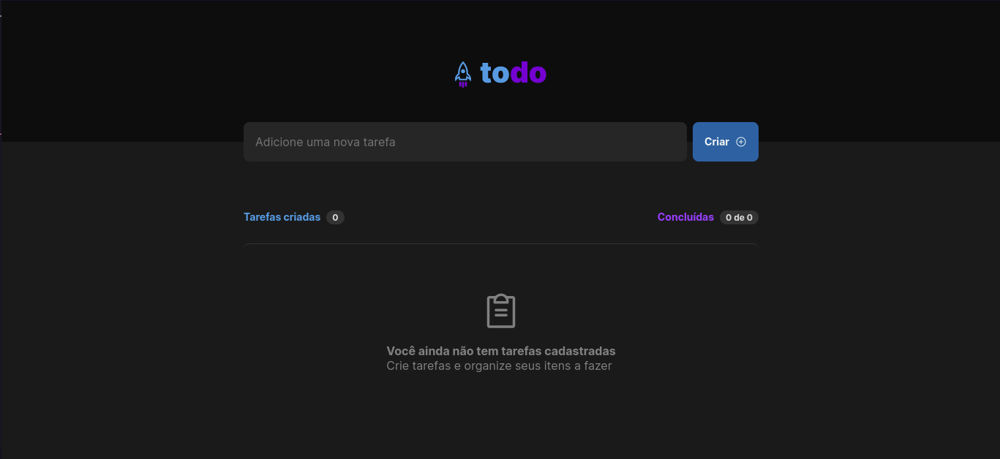
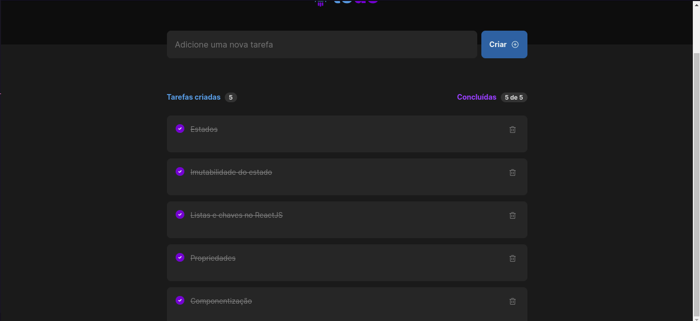

<h1 align="center">
      <a href="#" alt="site do ecoleta"> TODO </a>
</h1>

 <p align="center"> Gerenciador de tarefas.. </p>

 
<h4 align="center">
	🚧   Concluído... 🚀 🚧
</h4>


[](https://www.linkedin.com/in/jonas-martins-950a30184/)

Tabela de conteúdos
=================
<!--ts-->
   * [Sobre o projeto](#-sobre-o-projeto)
   * [Funcionalidades](#-funcionalidades)
   * [Layout](#-layout)
     * [Web](#web)
   * [Como executar o projeto](#-como-executar-o-projeto)
     * [Pré-requisitos](#pré-requisitos)
     * [Rodando a aplicação web (Frontend)](#user-content--rodando-a-aplicação-web-frontend)
   * [Tecnologias](#-tecnologias)
     * [WebSite](#user-content-website--react)

<!--te-->

---

## 💻 Sobre o projeto

   Todo - O desafio era pra criar uma aplicação de controle de tarefas no estilo to-do-list
   


## Funcionalidades
- Adicionar uma nova tarefa
- Marcar e desmarcar uma tarefa como concluída
- Remover uma tarefa da listagem
- Mostrar o progresso de conclusão das tarefas 

---

## 🎨 Layout

O layout da aplicação está disponível no Figma:

<a href="https://www.figma.com/file/kT0V1ZT4UJjw8sHLJ9EgDH/ToDo-List-(Copy)?node-id=12%3A106">
  
</a>


## Web

<p align="center" style="display: flex; align-items: flex-start; justify-content: center;">
  

  
</p>

---

## 🚀 Como executar o projeto


### Pré-requisitos

Antes de começar, você vai precisar ter instalado em sua máquina as seguintes ferramentas:
[Git](https://git-scm.com), [Node.js](https://nodejs.org/en/). 
Além disto é bom ter um editor para trabalhar com o código como [VSCode](https://code.visualstudio.com/)


### 🎲 Rodando o Front End

```bash
# Clone este repositório
$ git clone <https://github.com/jonasmartinsdev/Todo.git>

# Acesse a pasta do projeto no terminal/cmd
$ cd todo

# Instale as dependências
$ npm i

# Execute a aplicação em modo de desenvolvimento
$ npm run dev

```

---

## 🛠 Tecnologias

Esse projeto foi desenvolvido com as seguintes tecnologias:

- HTML
- CSS
- JavaScript
- Node.js
- React.js

---

## 📝 Licença

Este projeto esta sobe a licença [MIT](./LICENSE).

Feito com ❤️ por Jonas Martins 👋🏽 [Entre em contato!](https://www.linkedin.com/in/jonas-martins-950a30184)

---
